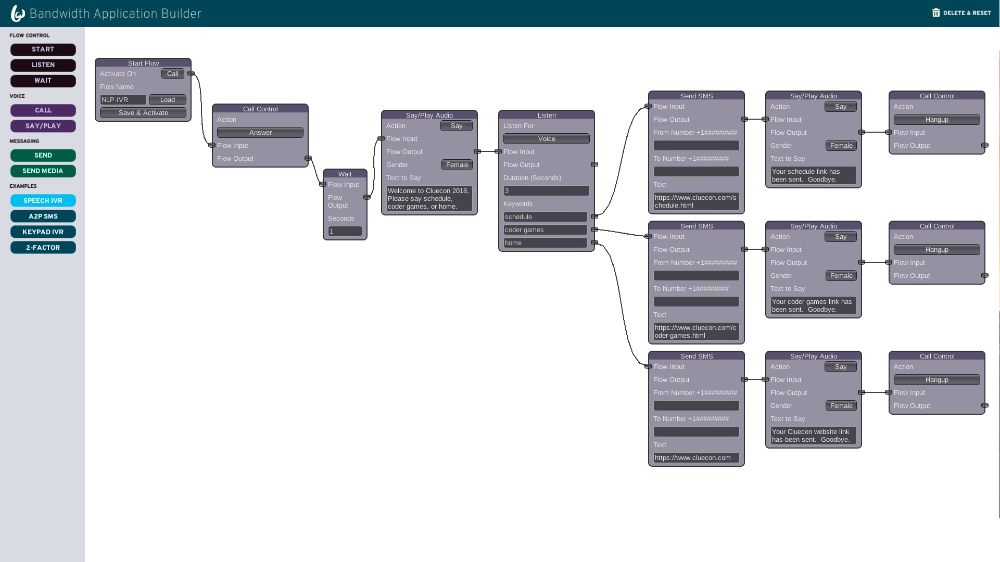

# cluecon-demo


## Project Setup

### User requirements
* You must have a Bandwidth account (https://app.bandwidth.com/).
* You must have a Google Cloud account (https://cloud.google.com/speech-to-text/).
* An ngrok account is optional but recommended (https://ngrok.com/).
    * Ngrok still needs to be installed on your system even without an ngrok account.

### System requirements
* Python version = 3.7.0
* Ngrok
* git

### Installation steps

* Instructions for downloading Python 3.7.0 can be found here https://www.python.org/downloads/.

* Instructions for downloading Ngrok can be found here https://ngrok.com/download.

* Instructions for downloading git can be found here https://git-scm.com/downloads.

#### Instructions to download the project

1. Open up a terminal.
2. Navigate to the directory that will hold the project.
3. Run the following commands to download the project and navigate to the project directory:
```
git clone https://github.com/Bandwidth/cluecon-demo.git
cd cluecon-demo
```

### Optional: Setup a python virtualenv
Optionally, a python virtual environment can be setup to avoid having pip installations be installed system-wide. After installing virtualenv, this can be done with the following commands:

```
virtualenv -p python3 <path-to-env>
source <path-to-env>/bin/activate
```

By setting the virtualenv python to python3, you can replace "python3" with "python" and "pip3" with "pip" for the rest of this guide.

### pip installations
Run the command
```
pip3 install -r requirements.txt
```
in the cluecon-demo repo to install the required pip dependencies.


After running the pip installations, running the command
```
pip3 freeze
```
should result in an output like this:
```
alabaster==0.7.11
Babel==2.6.0
cachetools==2.1.0
certifi==2018.4.16
chardet==3.0.4
click==6.7
dill==0.2.8.2
docutils==0.14
Flask==1.0.2
future==0.16.0
gevent==1.3.4
google-api-core==0.1.4
google-api-python-client==1.7.3
google-auth==1.5.0
google-auth-httplib2==0.0.3
google-cloud-core==0.25.0
google-cloud-language==1.0.2
google-cloud-monitoring==0.28.1
google-cloud-resource-manager==0.28.1
google-cloud-runtimeconfig==0.28.1
google-cloud-speech==0.34.0
google-cloud-storage==1.6.0
google-cloud-translate==1.3.1
google-resumable-media==0.3.1
googleapis-common-protos==1.5.3
greenlet==0.4.13
httplib2==0.11.3
idna==2.7
imagesize==1.0.0
itsdangerous==0.24
Jinja2==2.10
MarkupSafe==1.0
nine==1.0.0
oauth2client==3.0.0
packaging==17.1
ply==3.8
protobuf==3.6.0
pyasn1==0.4.3
pyasn1-modules==0.2.2
Pygments==2.2.0
pyparsing==2.2.0
pytz==2018.5
requests==2.19.1
rsa==3.4.2
seven==1.0.0
six==1.11.0
snowballstemmer==1.2.1
SpeechRecognition==3.8.1
Sphinx==1.7.5
sphinxcontrib-websupport==1.1.0
style==1.1.0
update==0.0.1
uritemplate==3.0.0
urllib3==1.23
Werkzeug==0.14.1
```

### Launching Ngrok
After installing Ngrok, it can be launched by running the following command:
```
ngrok http 5000
```

You will see a screen that looks like this:


Take note of the HTTPS Forwarding url. You will need this later in setting up the demo.

Leave this command running, and open a new terminal window.


### Environmental variables

The following environmental variables must be set:

```
BANDWIDTH_USER_ID
BANDWIDTH_API_TOKEN
BANDWIDTH_API_SECRET 
GOOGLE_APPLICATION_CREDENTIALS
APPLICATION_URL
```

Your Bandwidth credentials can be found here https://app.bandwidth.com/account/profile.


Your Google application credentials file can be found here https://console.cloud.google.com/projectselector/home/
1. Click "APIs & Services" on the left menu.
2. Click "Credentials" on the displayed menu.
3. Click "Create credentials" in the middle of the screen.
4. Select "Service account key".
5. Create a service account.
6. Select your role ("owner" should suffice for this demo)
7. Select "JSON" for key type.

After a few seconds, your file should download. Move this file to a place easily accessible by the demo code, and set GOOGLE_APPLICATION_CREDENTIALS to this file. You may need to surround the filename in quotes.


The APPLICATION_URL is your Ngrok url shown above.

### Launching the application
Once setup with Ngrok and the environmental variables, launch the application by running the following command:
```
python3 server/server.py
```

Optionally, environmental variables can be set at the same time as launching the application as shown below:
```
BANDWIDTH_USER_ID=u-12345 BANDWIDTH_API_TOKEN=t-12345 BANDWIDTH_API_SECRET=12345 GOOGLE_APPLICATION_CREDENTIALS="server.json" APPLICATION_URL=url python3 server/server.py
```

Depending on your system credentials, you may need to prefix this command with sudo in order to make the speech recognition feature work.


You should be able to go to your https Ngrok url and see the home page of the application.

### Purchasing a Bandwidth Phone Number
By going to your Ngrok url, you should see the flowchart creator for the application. However, any flow you create will not run without a Bandwidth number. The steps to get a Bandwidth number are as follows:

1. Go to https://app.bandwidth.com.
2. Log in to your account.
3. Go to the "Numbers" tab on the top right of the page.
4. Go to the "Buy" tab on the top left of the page.
5. Search for a number by areacode, zipcode, or city.
6. Select your desired phone numbers (note: if you are on a trial account with Bandwidth, select only one phone number due to limited funds in the trial account).
7. Click "Get Numbers" at the bottom of the screen.

You now have Bandwidth numbers to use for your flowchart.

### Assigning a Bandwidth Phone Number to your application
After purchasing a Bandwidth number, you need to assign this number to your application. Launching the server will automatically create a Bandwidth application under the name
```
<ngrok-url> CLUECON DEMO
```
You can see this under the "Applications" tab after logging in to https://app.bandwidth.com.


Clicking on the cluecon demo application should display application information. If you scroll down the page, you should see the "Associated Numbers" tab. Click the "+" sign to assign a number to this application.


Each time this application is ran with a different ngrok url, a new application is created. You will need to manually unassign your Bandwidth number from the previous application before assigning the number to the new application.

## Nodes
Nodes other than the "Start" node are connected via the "Flow Input" and "Flow Output" buttons. The "Start" node is connected via the "Activate On" button. Left clicking on one of these buttons will create a link that you can attach to another node button of the opposite type.

Naming your flow "default" will make it load immediately when accessing your server.

For "Send SMS", "Send MMS", and "Call (Create)" nodes, if the "Start" node is activated on a "Call" or "SMS", the "From Number" and "To Number" fields can be left blank and will be automatically field when the flow is activated by a call or SMS. 

* Start
    * Activate On- Select how the flow is activated.
        * Call- Activates flow when someone calls your Bandwidth number.
        * SMS- Activates flow when someone texts your Bandwidth number.
        * Now- Activates flow immediately.
    * Flow Name- Optional name for your flow.
        * If you have saved a previously named flow, you can load it here by typing that flow's name and clicking "Load".
    * Save & Activate- Saves and activates your flow.

* Listen
    * NOTE- The "Flow Output" button IS NOT USED for "Listen" nodes. Instead, each output is sent through the listen parameters.
    * Listen For- Selects how the node should listen.
        * Voice- Listen for vocal user input.
            * Keywords- Words to listen for.
        * Keypad- Listen for phone keypad input.
            * Max Digits- Maximum number of digits to listen for.
            * Terminating Digits- Digit that ends the user input.
            * Keypad Entry- Digits to listen for.
        * Text- Listen for keywords in a text message.
            * Keywords- Text words to listen for.
    * Duration (Seconds)- How long in seconds the listen node should wait.

* Wait
    * Seconds- Number of seconds to wait for.

* Call
    * Create- Creates a call.
        * From Number- Bandwidth number to make the call.
        * To Number- Recipient of the call.
    * Answer- Answers an incoming call.
    * Hangup- Hangup from the current call.

* Say/Play
    * Action- Audio action to execute.
        * Say- Says text.
            * Gender- Male or female voice to speak.
            * Text to Say- User input of text to say
        * Play- Plays audio from an audio url.
            * Audio Url- URL of audio file.

* Send
    * From Number- Bandwidth number to send a message.
    * To Number- Recipient of the text message.
    * Text- Contents of the text message.

* Send Media
    * Same as Send node, but sends MMS instead of SMS

## User Operations
* Left click
    * Drag node
    * Select node
    * Create a link between nodes
    * Change a field in a node
* Left click and drag
    * Select multiple nodes
* Right click
    * Drag screen
    * Detach a link between nodes
* Delete key
    * Delete selected nodes

## Known issues
* The application will not properly update nodes unless in fullscreen mode.
* Sometimes when creating a new node while a previous node is present on the center of the screen, you will not be able to select anymore nodes.


## Bandwidth Python SDK
Although this project is written in python, it does not use Bandwidth's python SDK. If you wish to learn more about Bandwidth's python SDK in order to write more sophisticated applications, please visit https://dev.bandwidth.com/python-bandwidth/.
